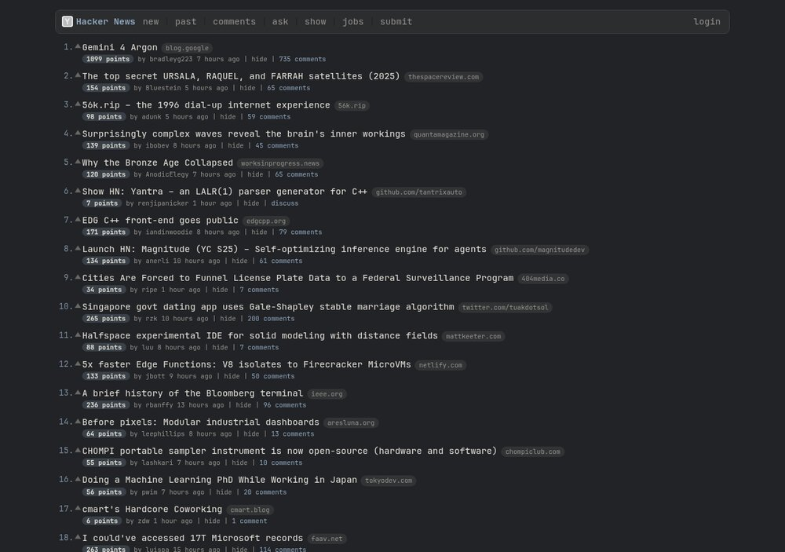
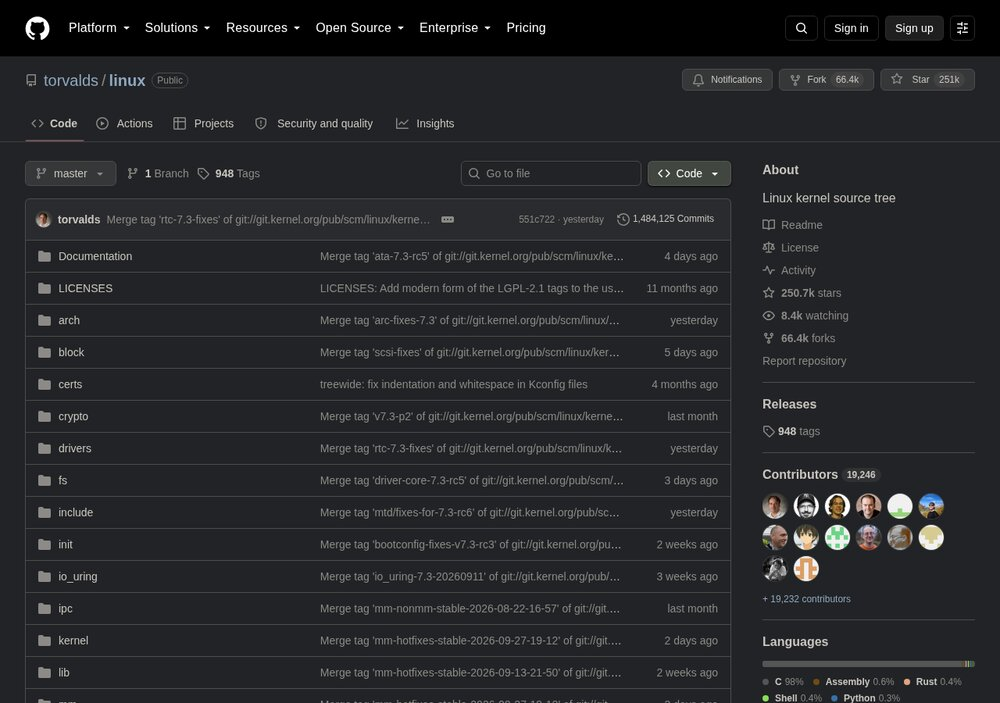
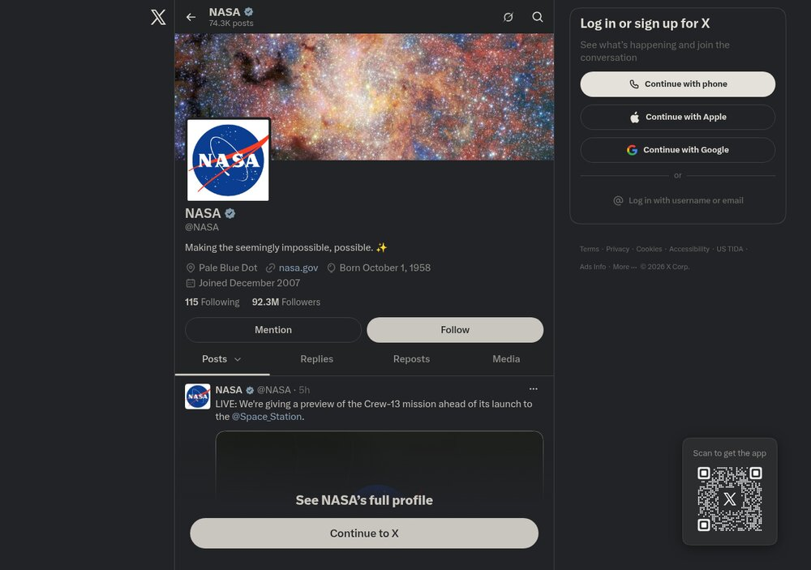
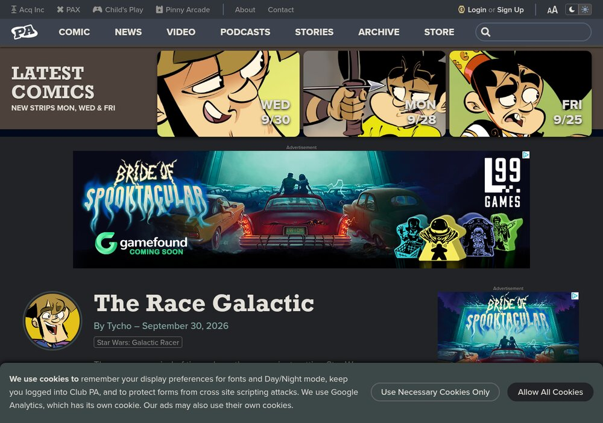

# Omarchy Site Themes

Recolor the websites you read every day to match your
[Omarchy](https://omarchy.org) theme. When you switch themes, open tabs
follow within a couple of seconds, with no reload. A small Chrome extension
does the recoloring, and an Omarchy hook keeps its palette in sync.

<p align="center">
  
  
</p>
<p align="center">
  
  
</p>

## Sites

| Site | How it's themed |
|------|-----------------|
| Hacker News | A full restyle in your Omarchy font. Domain and score pills, row hover, theme-colored vote arrows, and comment threads color-coded by depth. |
| Reddit, YouTube, Google News, Gmail | The site's own design tokens, remapped. |
| GitHub, Facebook | Design tokens, remapped by generator scripts in `tools/`. |
| X | `--x-*` and shadcn tokens. Set X to a dark display mode (Settings > Display > Lights out or Dim). |
| old Reddit, Penny Arcade, Edison Report, Inside Lighting, Daring Fireball, MMO-Champion, xkcd | The remap engine (below). |

## Install

You need Omarchy and Google Chrome (or Chromium).

```bash
git clone https://github.com/Evansbee/omarchy-site-themes.git ~/.local/share/omarchy-site-themes
~/.local/share/omarchy-site-themes/install.sh
```

The install script adds `theme-set` and `font-set` hooks that point at the
clone, then writes your current palette into the extension. Keep the clone
where you put it.

Then load the extension in Chrome, once:

1. Open `chrome://extensions` and turn on **Developer mode**.
2. Click **Load unpacked** and choose the clone's `extension/` folder.
3. Refresh any open tabs on the supported sites.

**Update:** `git -C ~/.local/share/omarchy-site-themes pull`, then click the
reload arrow on the extension's card in `chrome://extensions`.

**Turn it off:** disable the extension in `chrome://extensions`.

**Remove:** run `uninstall.sh` to delete the hooks, remove the extension in
Chrome, then delete the clone.

## How it works

1. `bin/omarchy-site-themes-sync` reads the current theme's `colors.toml`
   and font. It writes them to `extension/colors.css` as `--om-*` CSS
   variables, plus HSL triplets for sites that need them. The Omarchy hooks
   run it on every theme or font change.
2. `extension/theme.js` loads that file into each supported page and checks
   it again every two seconds while the tab is visible. It caches the
   palette per site, so the next visit is themed before first paint.
3. Each site is then recolored in one of two ways:
   - **Token sites** (`extension/sites/*.css`): most modern sites color
     everything through CSS custom properties. Overriding those properties
     with palette values recolors the whole site cleanly.
   - **Remap engine** (`extension/remap.js` and `extension/palette.js`):
     for sites that hard-code their colors. It reads the site's stylesheets
     and inline styles, then rewrites every color as a mix of palette
     variables.
     - Grays keep their place between the site's own background and text.
     - Colored values snap to the nearest palette hue, and the site's
       dominant brand color becomes your accent.
     - Background fills are kept low and text high, so text stays readable
       whatever the site paired it with.
     - Page wallpapers are dropped.

## Adding a site

Try the remap engine first, since it often works with no site-specific code.

1. In `extension/manifest.json`, add a `content_scripts` entry with the
   site's match patterns:
   - For the remap engine: `"js": ["theme.js", "palette.js", "remap.js"]`
     and `"css": ["base.css"]`.
   - For a hand-written theme: `"js": ["theme.js"]` and
     `"css": ["base.css", "sites/<site>.css"]`. Scope every rule to
     `html[data-omarchy-themed]` and use the `--om-*` variables from
     `base.css` and `colors.css`.
2. Add the same match patterns to `web_accessible_resources`.
3. If the remap engine needs stylesheets from another host, such as a CDN,
   add that host to `host_permissions`.
4. Reload the extension.

To regenerate the token maps after GitHub or Facebook change their design
systems, run `tools/gen-github.js`. For Facebook, see the header of
`tools/gen-facebook.js`.

## Troubleshooting

- **A site didn't change.** Reload the extension, then hard-refresh the tab.
  Check that `extension/colors.css` exists. If it doesn't, run
  `bin/omarchy-site-themes-sync`.
- **A remapped site looks wrong.** Open an issue with a screenshot and the
  URL. Sites built from generated CSS can confuse the engine. Gmail did,
  which is why it uses tokens instead.

## License

MIT
